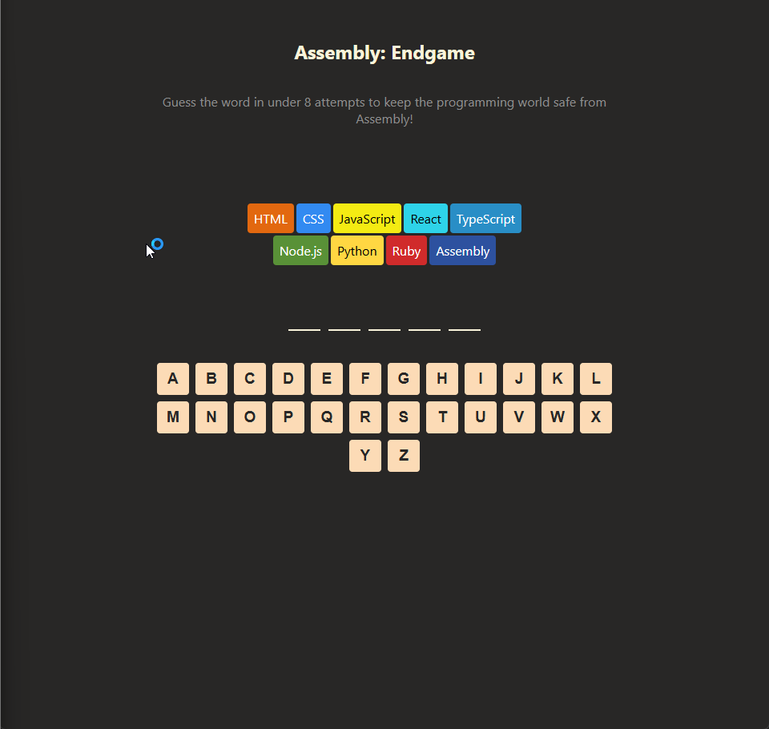

# Assembly Endgame

A fun, hangman-style word guessing game built with React! In this game, instead of building a hangman, you must guess the word correctly to save various programming languages from being eliminated. For every wrong guess, a language "dies". 

This was built as a capstone project for the Scrimba React Course.
## Screenshot



## Features
- **Dynamic Keyboard**: Interactive A-Z keyboard that updates visually (green for correct guesses, red for wrong guesses).
- **Game Logic**: Win and loss detection with celebratory/game-over status banners.
- **Language Health**: A list of programming languages that cross themselves out as the player makes incorrect guesses.
- **Randomized Words**: Words are chosen randomly from a tech-focused dictionary.

## Tech Stack
- **React** (Hooks: `useState`)
- **CSS3** (Flexbox, Dynamic styling)
- **Vite** 

## Running Locally

1. Clone the repository:
   ```bash
   git clone <your-repo-url>
   ```
2. Navigate into the directory:
   ```bash
   cd AssemblyEndgame
   ```
3. Install dependencies:
   ```bash
   npm install
   ```
4. Start the development server:
   ```bash
   npm run dev
   ```

## Preview

Try to guess the word before Assembly is eliminated!
